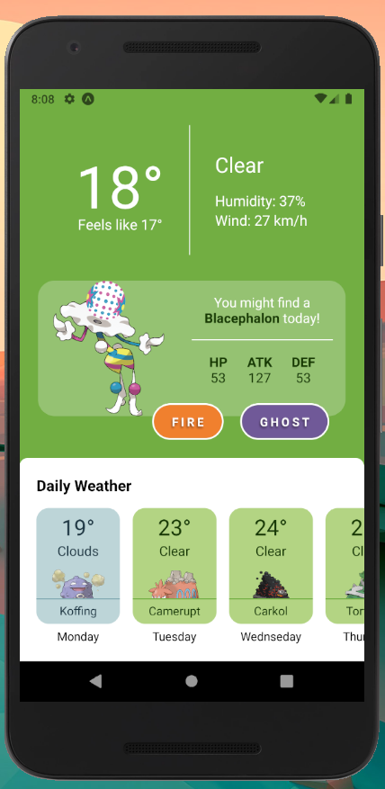

# Pokemon Weather App

This app was created with [React Native](https://reactnative.dev/) using [Expo](https://expo.dev/).

Based on Pokémon Go's concept of finding Pokémon depending on the weather, this weather app provides a more detailed view of pokémon that the player might run into during the week.

Note: This app was only developed and tested on Android!

The Pokemon Weather app depends on the data of two API's:

- [Open Weather API](https://openweathermap.org/api)
- [Poké API](https://pokeapi.co/)

## Installation

1. Run `npm install` before using the application locally.
2. You'll need an Open Weather API key to run this application.

   - To set your Open Weather API key, create a `.env` file at the root of this directory.
   - Within the `.env` file, write the following: `OPEN_WEATHER_API_KEY={YOUR_API_KEY}`

3. To run the application, run `expo start`.
